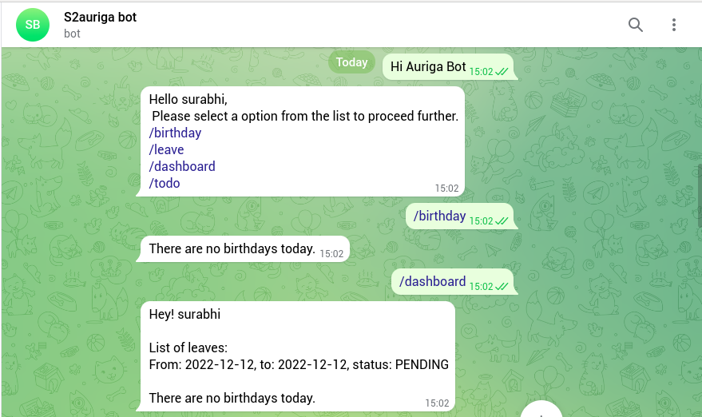

# AurigaBot #

### Quick summary ###
* A generic chatbot which can be extended to different (like telegram, google-chat, etc) which can perform multiple functionalities and can be used by members for general queries, leave application, birthday notification etc.
  
* This is currently developed for telegram, we will expand it to use in whatsapp in future.

### Inspiration ###
* We faced a lot of issues when accessing our work mails due to a lot of irrelevant mails like birthday, new joining, work anniversary and other mails and leave applications.
* So to keep our work space clean we came up with an idea for this bot which will handle all these mails and applications.

### Technology stack ###
* Java 8
* Maven
* Spring Boot
* Spring Data
* Reactive Stack
* WebFlux
* R2DBC
* PostgreSQL
* Kafka

### Commands ###
* /dashboard- personalized message to show useful information.
* /birthday- show list of people having birthday on that day.
* /leaverequest- bot asks certain question for sending leave application.
* /approveleaverequest - approve leave requests submitted by other users.
* /todo- coming soon.
* /events - See or create google calender events.

## Run on Gitpod ##

### Future Scope ###
* Whatsapp Adapters
* Additional functionalities using buttons to different commands
* Leave Request
* TODO List
* Helpdesk
* Surveys
* Add more functionalities to birthday command
* Notification Bot