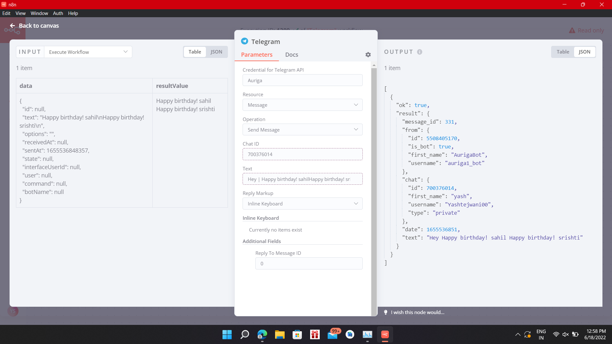
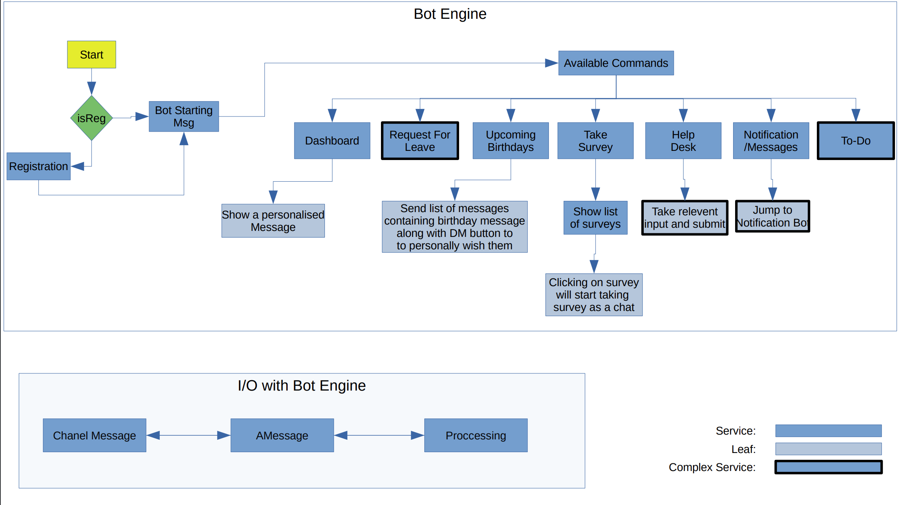

# AurigaBot #

### Quick summary ###
* A generic chatbot which can be extended to different (like telegram, google-chat, etc) which can perform multiple functionalities and can be used by members for general queries, leave application, birthday notification etc.
  

### Inspiration ###
* We faced a lot of issues when accessing our work mails due to a lot of irrelevant mails like birthday, new joining, work anniversary and other mails and leave applications.
* So to keep our work space clean we came up with an idea for this bot which will handle all these mails and applications.

### Technology stack ###
* Java 8
* Maven
* Spring Boot
* Spring Data
* JPA
* MySql
* N8N

### Commands ###
* /dashboard- personalized message to show useful information.
* /birthday- show list of people having birthday on that day.
* /surveys-bot will reply with a message/heading of survey of available surveys.
* /todo- bot will send list of todos in sorted form and also sends a button to create a new todo.
* /leaverequest- bot asks certain question for sending leave application.
* /helpdesk- we can submit a query/complaint to helpdesk.

### Future Scope ###
* Adapters
* Additional functionalities using buttons to different commands
* Leave Request
* TODO List
* Helpdesk
* Surveys
* Add more functionalities to birthday command
* Notification Bot

### Arhitecture ###
